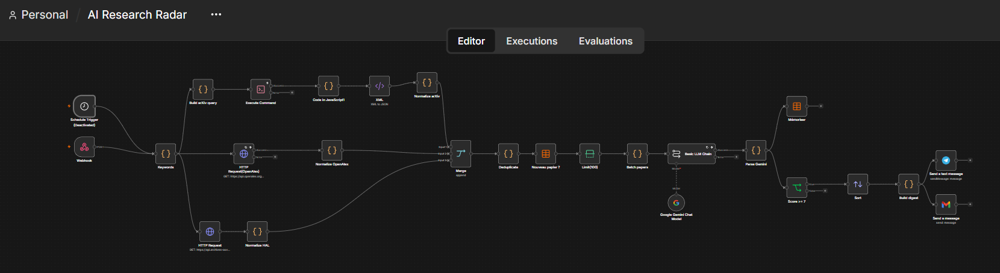
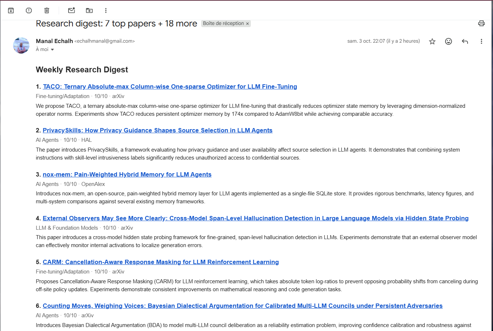
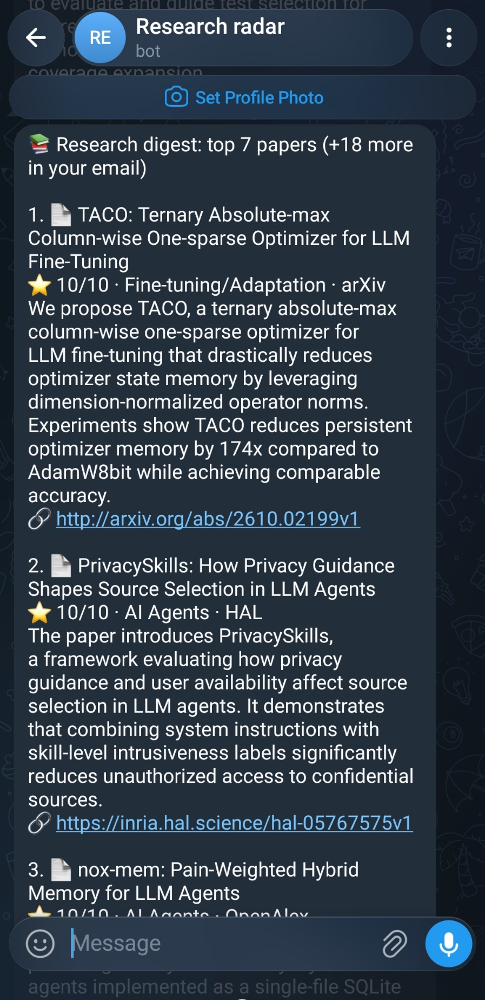
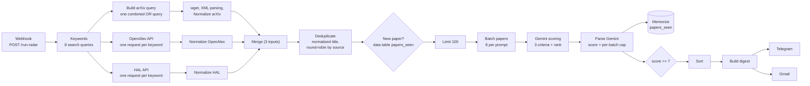

# AI Research Radar

A free, low-code research-monitoring agent built with **n8n**. Every week it collects new papers from **arXiv, OpenAlex and HAL**, removes duplicates, scores them with **Gemini** against eight AI-engineering topics, and sends a ranked digest by **Telegram** and **email**.

- **Cost: 0 €.** Everything runs on free tiers; no credit card required.
- **Low-code:** one n8n workflow, a few small JavaScript nodes, no server code.
- **Idempotent:** a paper is scored once, then remembered, so it never reaches the digest twice.

<p>
  
  
</p>

## What the digest looks like

Each run produces:

- a **Telegram message** with the top 7 papers (title, score, category, source, two-sentence English summary, link);
- an **email** with the same top 7 plus a short "More worth a look" list of up to 20 further papers.

The eight topics the scoring is built around: LLM & Foundation Models · AI Agents · RAG & Information Retrieval · Fine-tuning/Adaptation · NLP · MLOps/AI Systems · Efficient AI · AI Evaluation.

## Architecture



### Pipeline in detail

| Stage | What it does |
|---|---|
| **Trigger** | A `Webhook` node (`POST /webhook/run-radar`) starts the run. A deactivated `Schedule Trigger` is kept for server deployments (see [deployment](docs/DEPLOYMENT.md)). |
| **Keywords** | A single code node holds the eight search queries. **Every source reads this one list**, so changing a topic means editing one place. |
| **arXiv** | One combined query (`OR` between keywords), newest 60 results. Fetched with `wget` through an `Execute Command` node because arXiv answers the n8n HTTP Request node with HTTP 406. |
| **OpenAlex** | One request per keyword, last 7 days, articles and preprints, free API key. Works that carry an arXiv DOI are skipped (already covered). Abstracts arrive as an inverted index and are rebuilt into text. |
| **HAL** | One request per keyword, current year and a 7-day window on the submission date. Records linked to an arXiv id are skipped. |
| **Merge + Deduplicate** | The three sources are normalized to the same fields (`paper_id`, `title`, `summary`, `published`, `url`, `source`) and merged. Duplicates are removed by normalized title (lowercase, no accents or punctuation), keeping the most reliable source. The list is then interleaved source by source so the later `Limit` cannot starve one source. |
| **New paper?** | Looks up `paper_id` in the `papers_seen` data table and keeps only unseen papers. |
| **Batching** | Up to 100 papers are grouped by 8 per prompt: about 13 Gemini calls per run instead of 100, which keeps the run under the free-tier rate limit. |
| **Scoring** | Gemini rates each paper on three criteria and ranks the papers inside the batch (see below). |
| **Memorize** | Every scored paper is written to `papers_seen`, whatever its score, so it is never scored again. |
| **Digest** | Papers with a score of 7 or more are sorted and formatted for Telegram and email. At most 4 of the top 7 may come from the same source. |

## How scoring works

The full prompt is in [`docs/scoring-prompt.md`](docs/scoring-prompt.md). In short:

- Gemini returns three integer criteria per paper: **relevance** (0-4), **utility** (0-3) and **rigor** (0-3), plus its category and a **rank** inside the batch.
- `Parse Gemini` adds the criteria into a **score out of 10**. A paper outside the eight topics is categorized `Autre` and capped at 3.
- **Forced distribution:** inside each batch, only the two best papers may reach 7 or more; the others are capped at 6.

Why the cap exists: scoring papers one at a time, or in batches without a cap, made the model generous (nearly every paper got 8 or more). With at most 13 batches and 2 papers per batch, a run can produce at most 26 papers at 7+, which always fits the digest (7 detailed + 20 listed), so no selected paper is ever left unseen.

LLM answers are matched to papers by the `paper_id` the model returns, not by position, so a missing or reordered answer cannot attach a score to the wrong paper.

## Reference run

One complete run on 3 October 2026, starting from an empty `papers_seen` table:

| | arXiv | OpenAlex | HAL | Total |
|---|---|---|---|---|
| Papers scored | 54 | 36 | 10 | **100** |
| Scored 7 or more | 20 | 4 | 1 | **25** |

- 36 of the 100 papers were classed `Autre` (outside the eight topics).
- The workflow took about 25 seconds end to end, with about 13 Gemini calls.
- A sample of the resulting table is in [`examples/papers_seen.sample.csv`](examples/papers_seen.sample.csv).

## Design decisions and lessons

- **arXiv blocks the n8n HTTP node (HTTP 406).** Using `wget` in an `Execute Command` node works, at the price of enabling that node in n8n.
- **Rate limits shaped the design.** Batching eight papers per call and matching answers by `paper_id` replaced one call per paper.
- **Sources must fail independently.** The normalization nodes return an empty list instead of throwing, so one source returning nothing never blocks the others.
- **Memory only for scored papers.** A batch that fails (rate limit, invalid JSON) is not memorized and is simply retried the next week.
- **Webhook instead of a cron inside n8n.** The workflow is started from outside, so n8n does not have to stay running all week (see [deployment](docs/DEPLOYMENT.md)).

## Known limitations

- **Scores are relative, not absolute.** The forced distribution makes the top two of each batch look excellent: in the reference run, 24 of the 25 selected papers show 10/10. The score tells you "best of its batch", and the ordering across batches is only approximate.
- **OpenAlex keyword search is broad.** Its search covers full text, so some results are only loosely related; the model filters them out, but they cost quota.
- **arXiv uses one combined query** sorted by date, so very active topics can crowd out quieter ones such as MLOps.
- **Deduplication across weeks relies on `paper_id`.** The same paper arriving later from another source under a different id could be scored twice.
- **No feedback loop yet:** the digest cannot learn from what you read.
- **The webhook has no authentication.** Keep n8n bound to `127.0.0.1` (the provided script does) or add authentication before exposing it.
- **No automated tests.** The workflow was validated manually, run by run.

## Roadmap

- Add **Semantic Scholar** and **OpenReview** as further sources (one HTTP node, one normalization node, one more `Merge` input each).
- Restrict OpenAlex search to title and abstract.
- Query arXiv once per keyword for a better topic balance.
- Second scoring stage: re-rank the 25 or so survivors in a single Gemini call to get meaningful absolute scores.
- Store a `status` column (`sent`, `rejected`, `pending`) so papers beyond the digest capacity roll over to the next week.
- Always-on free hosting (Render + Supabase + a keep-alive ping) to enable Telegram 👍/👎 feedback buttons, which need a public HTTPS URL.
- Publish each digest as a static page with GitHub Pages.

## Relation to PaperRadar

This project is a low-code re-implementation of **PaperRadar**, a Python tool for the same purpose.

<!-- TODO (author): fill in the real comparison with your PaperRadar project, for example:

| | PaperRadar (Python) | AI Research Radar (n8n) |
|---|---|---|
| Implementation | | n8n workflow + small JS nodes |
| Sources | | arXiv, OpenAlex, HAL |
| Scoring | | Gemini, batched, forced distribution |
| Outputs | | Telegram + email |
| Scheduling | | Webhook + Windows Task Scheduler |
| Cost | | 0 € |
-->

## Getting started

1. Follow [`docs/SETUP.md`](docs/SETUP.md) to run n8n, create the credentials and the data table, and import the workflow.
2. Optionally automate the weekly run with [`docs/DEPLOYMENT.md`](docs/DEPLOYMENT.md).

## Repository layout

```text
ai-research-radar/
├── README.md
├── LICENSE
├── workflow/ai-research-radar.json     # n8n export (no secrets, inactive on import)
├── scripts/run-radar.bat               # weekly Windows launcher
├── docs/
│   ├── SETUP.md
│   ├── DEPLOYMENT.md
│   ├── scoring-prompt.md
│   └── images/                         # screenshots
└── examples/papers_seen.sample.csv
```

## License

MIT, see [LICENSE](LICENSE).
# ai-research-radar

